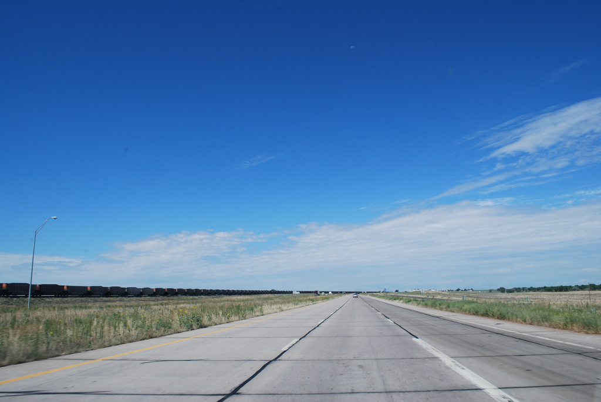

# reveal-ck

Getting Started with [Markdown][markdown-ref]

---

### Gem Installation

`gem install reveal-ck`

---

### Bundler Installation

Gemfile:

    source 'https://rubygems.org'
    gem 'reveal-ck'

---

## Generating Slides

1. `reveal-ck generate`
2. `open slides/index.html`

---

## Presenting Slides

* Easily show presentation from your laptop
* Don't *need* to host slides
* Start webserver (http://) for speaker mode

<aside class="notes">

Start up the server with `reveal-ck serve`
if you want speaker mode.

By default, slides will be available
at http://localhost:10000.

</aside>

---

## `config.yml`

```
theme: sky
transition: fade
title: Getting Started
author: Jed Northridge
```

---

## Images!

If using images, consider:

* placing them in `images/`
* referencing relatively

---




<aside class="notes">
It was a beautiful day, the sun beat down.
I had the radio on, I was drivin'.
Trees flew by, me and Del were singin' little Runaway.
I was flyin'.
</aside>

[markdown-ref]: http://daringfireball.net/projects/markdown/syntax
